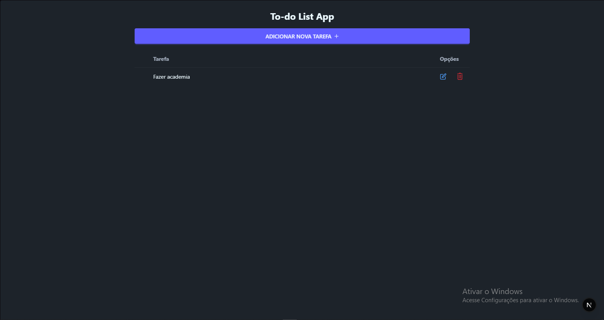
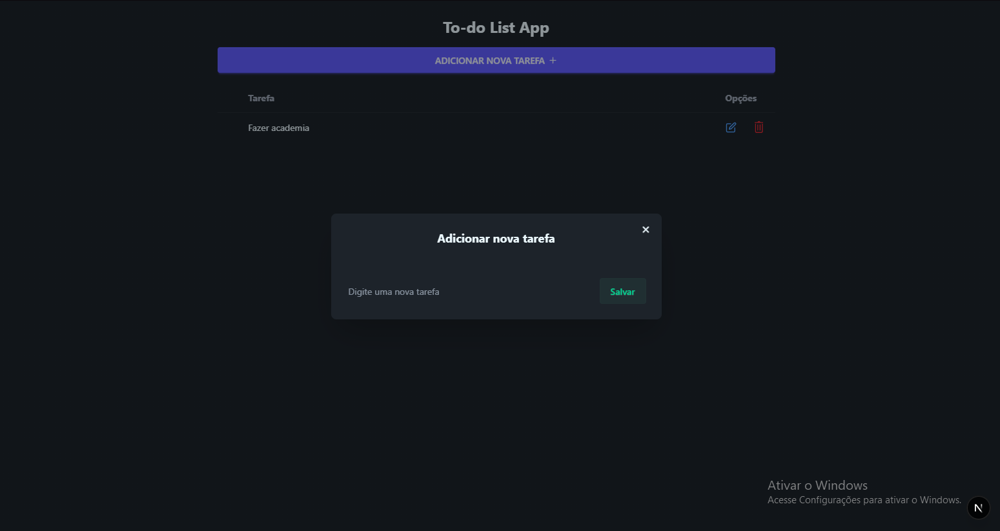
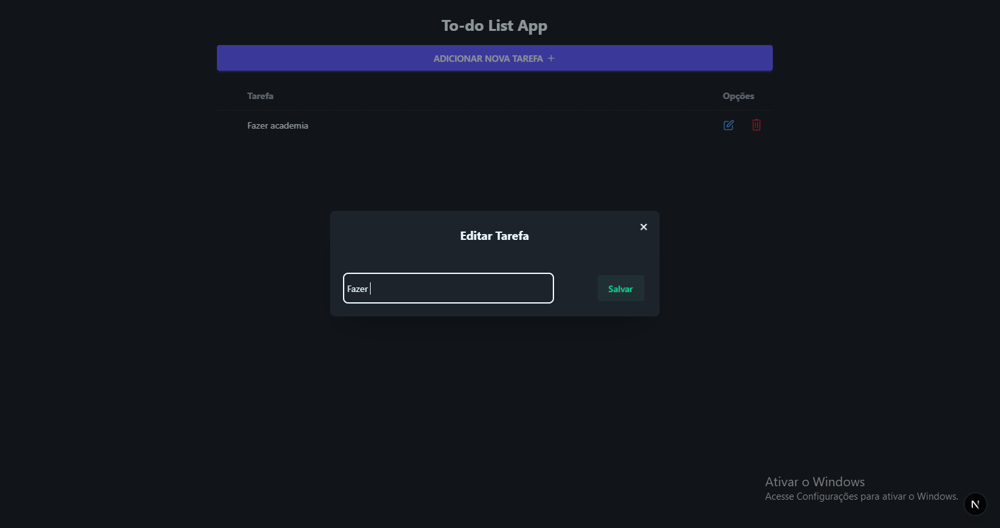
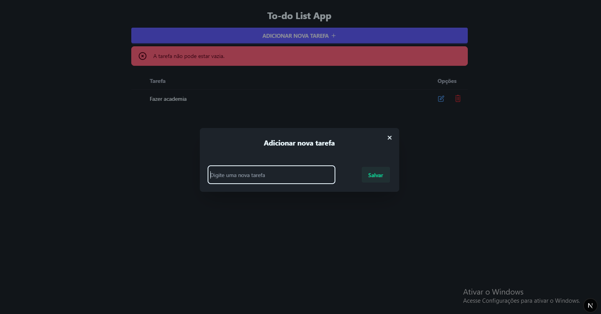

# 📝 To-do List App

Uma aplicação simples de lista de tarefas criada com **Next.js**, **TypeScript** e **Tailwind CSS**. Permite adicionar, editar e excluir tarefas de forma rápida e intuitiva.

## 💡 Visão Geral

Este é um app de lista de tarefas simples e funcional feito com Next.js + Tailwind.

### 📸 Tela principal


### ✅ Adicionando tarefa


### ✏️ Editando tarefa


### 🗑️ Excluindo tarefa


### ⚠️ Alerta de erro


---

## 🚀 Funcionalidades

- ✅ Adicionar nova tarefa
- 📝 Editar tarefa existente
- ❌ Excluir tarefa
- 💾 Persistência com API local (`JSON Server`)
- 💡 Alertas amigáveis para validação e sucesso

---

## 🧰 Tecnologias Utilizadas

- [Next.js 14](https://nextjs.org/)
- [React](https://react.dev/)
- [TypeScript](https://www.typescriptlang.org/)
- [Tailwind CSS](https://tailwindcss.com/)
- [React Icons](https://react-icons.github.io/react-icons/)
- [JSON Server](https://github.com/typicode/json-server)

---

## 📦 Exemplo de Objeto `Task`

```ts
interface ITask {
  id: string;
  task_text: string;
}
```

---

## 📌 Melhorias Futuras

- [ ] Marcar tarefa como concluída
- [ ] Substituir `alert()` padrão por componentes de alerta estilizados (ex: componentes de feedback com cores e ícones informativos).
- [ ] Implementar validação mais robusta dos dados inseridos pelo usuário, com uso de regex e mensagens personalizadas.
- [ ] Filtro por tarefas ativas/concluídas
- [ ] Filtro por Urgência da tarefa

---

## 👩‍💼 Autora

**Seu Nome**  
GitHub: [@DanielaLino-dev](https://github.com/DanielaLino-dev)
